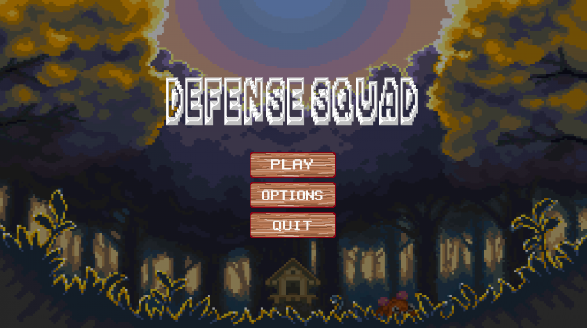
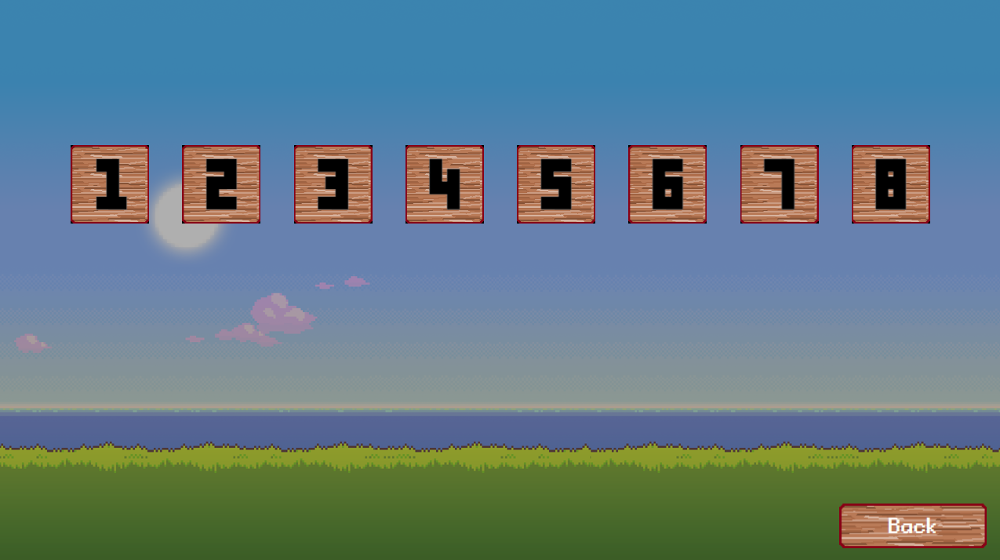
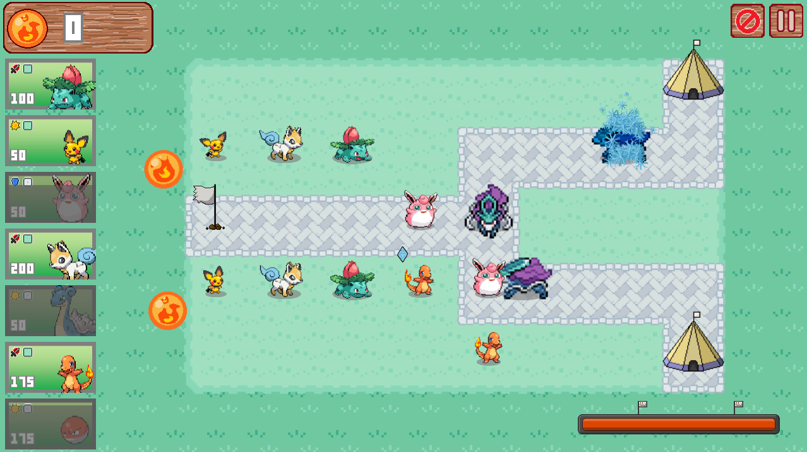
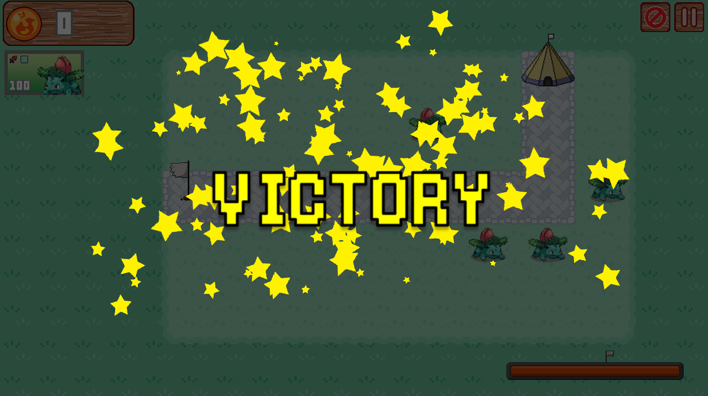
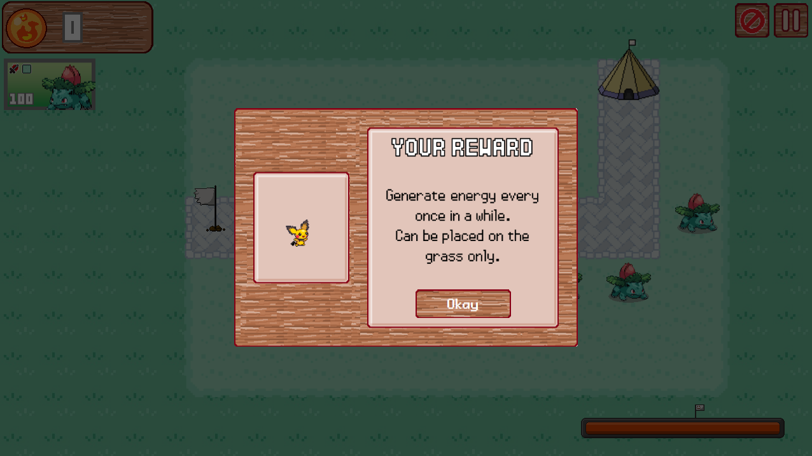

# Defense Squad - Team Bloody Penguins

## About the project

Defense Squad is a game made in around 45 days for Android/Windows operating systems.

## System requirements

Windows: Windows 8.0+

Android: Android 4.0+ (best with 8.1+)

## Some Screenshots

## Download and installing

Current version: 1.0.0

Download at folder: \Release

## Technology used

C++/Cocos2d-x 4.0

Piskel

## Team member

[@friedcroco070801](https://github.com/friedcroco070801)

[@manhnq0508](https://github.com/manhnq0508)

[@nguyenvantinh06](https://github.com/nguyenvantinh06)

## Disclamer

This game is free and will not be used for any commercial purposes.

Most of the resources are not ours. They belong to various official games.

- Sprites: from Pokémon Black/White and fanmade Xenoverse

- Sound effects: from Pokémon series

- Background music: from Tales of Vesperia and Genshin Impact